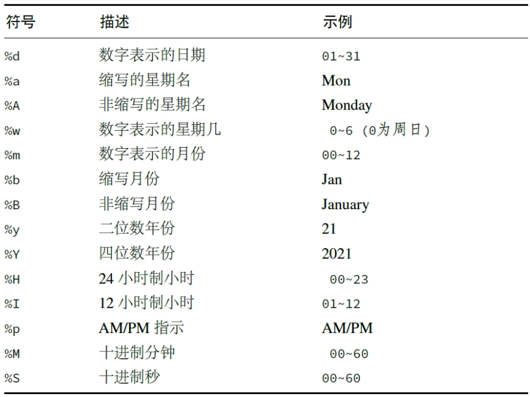

```{r setup, include = FALSE}
knitr::opts_chunk$set(
  collapse = TRUE,
  comment = "#>",
  warning=FALSE,
  error=TRUE,
  message=FALSE
)
```

```{r}
library(tidyverse)
```

1.  识别日期时间
```{r}
today() # 日期型 date
now() # 日期时间型 datetime

as_datetime(today()) 
as_date(now())
```

```{r}
# R能识别绝大多数日期时间
ymd("2020/03-01")
myd("03202001")
dmy("03012020")
ymd_hm("2020/03~011213")
```

```{r}
# 从日期组件中创建日期时间
make_date(2020,12,27)
make_datetime(2020,12,27,20,08,04)
```
其中，日期组件是指“年、月、日、周、时、分、秒”等，常用的有以下几种：

2. 格式化输出时间
```{r}
d <- make_date(2020,3,5)
format(d, "%Y/%m/%d")

fmt1 <- stamp("Created on Friday, Jan 1, 1999 3:34 pm")
fmt1(now())
```
3. 提取日期时间数据的组件
```{r}
t <- ymd_hms(now())
t
```
```{r}
year(t)
quarter(t) # 第几季度
month(t)
day(t)
hour(t)
minute(t)
yday(t) # 一年中第几天
second(t)
weekdays(t)
wday(t) # 本周第几天
wday(t, label = T)
week(t) # 一年中第几周
tz(t)
```
```{r}
with_tz(t, tz = "America/New_York")
```
4. 时间段数据
```{r}
begin <- ymd_hms(now())
end <- ymd_hm("2025-06-01 00:00")
gap <- interval(begin, end) # 计算两个时间点的间隔，返回时间段数据
gap
begin %--% end
```
```{r}
time_length(gap, "day")
time_length(gap, "minute")
t %within% gap # t时点是否在这时间段内
```
```{r}
duration(time_length(gap, "day"), units = "day") # 用“数值+时间单位”储存时段的长度
int <- as.duration(gap)
int
```
```{r}
# 使用period，相较于duration(每年有365.25天)，考虑了时间线并且考虑闰年(平年有365，闰年有366)
```
- period: years()、months()、weeks()、days()、hours()、minutes()、seconds()
- duration: 前面加个“d”，例如：dyears()、dmonths()...
```{r}
dyears(1)
years(1)
```
5. 时间点的计算
```{r}
# 时间点＋时间段
t + int
```
```{r}
leap_year(2024) # 判断是否为闰年

ymd(20240608) + years(1)
ymd(20240608) + dyears(1)
t + weeks(1:3)
```
```{r}
gap / ddays(1)
time_length(gap,"day")
gap %/% ddays(1) # 整除
gap %% ddays(1) # 求余数
as.period(gap %% ddays(1))
```
```{r}
# 月份加运算
date <- as_date("2024-06-08")
date %m+% months(0:12)
```
```{r}
# 生成近似的时间刻度
x <- seq(as.Date("2024-06-08"), by = "year", length.out = 2)
x
pretty_dates(x,12)
```


